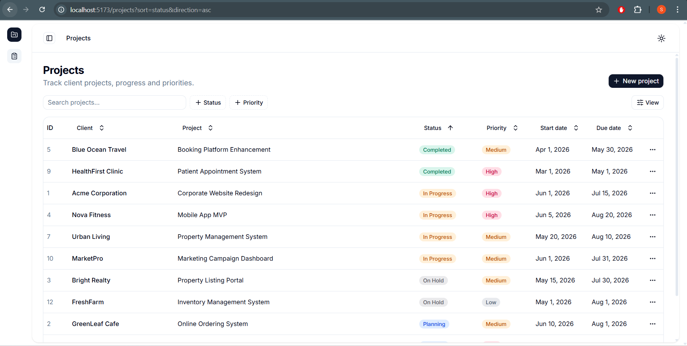

# Client Project Tracker



A full-stack **Client Project Tracker** for a digital agency. Project managers can create, update, view, and delete client projects, track their status/priority, and search, filter, and sort across them.

See [docs/ASSESSMENT.md](docs/ASSESSMENT.md), [docs/REQUIREMENTS.md](docs/REQUIREMENTS.md) and [docs/SUBMISSION.md](docs/SUBMISSION.md) for the original brief, and [docs/TECHNICAL_REFLECTION.md](docs/TECHNICAL_REFLECTION.md) for the submission reflection.

---

## Tech Stack

**Frontend** (`frontend/`) — Vite 8 + React 19 + TypeScript
- Tailwind CSS v4 + Radix UI primitives, assembled into a custom component library and design system
- TanStack Query for server state, TanStack Table for the data grid
- react-hook-form + Zod for form validation
- Server-driven search / filter / sort / pagination, with table state synced to the URL
- A dev-only in-browser mock API (`VITE_USE_MOCK=true`) to iterate on the UI quickly during development — the real Laravel API is the default

**Backend** (`backend/`) — Laravel 13 + PHP 8.4
- Used **Interface-Service-Repository** architecture (`app/Interface`, `app/Service`, `app/Repository`)
- SQLite by default, MySQL-ready via `.env`
- [eloquentfilter](https://github.com/Tucker-Eric/EloquentFilter) for declarative query filtering (`app/ModelFilters`)
- UUIDs for public API identifiers, numeric IDs internally
- 19 PHPUnit tests covering the API contract

## Repository Structure

```
├── backend/                 # Laravel REST API
│   ├── app/
│   │   ├── Enums/           # ProjectStatus, ProjectPriority
│   │   ├── Http/Controllers, Requests, Resources
│   │   ├── Interface/Service, Interface/Repository
│   │   ├── ModelFilters/    # ProjectFilter (search/filter/sort)
│   │   ├── Models/          # Project (+ UsesUuid trait)
│   │   ├── Repository/      # ProjectRepository
│   │   ├── Service/         # ProjectService
│   │   └── Traits/          # UsesUuid
│   ├── database/seeders/    # seeds test_data.json (12 projects)
│   └── tests/Feature/       # ProjectApiTest
├── frontend/                # React SPA
│   └── src/
│       ├── features/projects/   # projects list, table, dialogs, forms
│       ├── components/          # UI + data-table + app shell
│       └── lib/                 # api-client, mock-api, handle-server-error
├── docs/                    # original brief + submission reflection
│   ├── ASSESSMENT.md
│   ├── REQUIREMENTS.md
│   ├── SUBMISSION.md
│   └── TECHNICAL_REFLECTION.md
└── test_data.json           # seed fixture (12 projects)
```

---

## Prerequisites

- **PHP ≥ 8.2** and **Composer** (backend)
- **Node ≥ 20.19** and **pnpm** (frontend)
- **SQLite** (default; no server needed) or **MySQL** (optional)

## Setup & Run

### Backend

```bash
cd backend
composer install
cp .env.example .env          # then configure DB (SQLite is the default)
php artisan key:generate
php artisan migrate --seed    # creates tables + seeds the 12 projects
php artisan serve             # http://127.0.0.1:8000
```

> To use MySQL instead, set `DB_CONNECTION=mysql`, create the database, then run `php artisan migrate:fresh --seed`.

### Frontend

```bash
cd frontend
pnpm install
cp .env.example .env          # VITE_USE_MOCK=true runs the mock API
pnpm dev                      # http://localhost:5173
```

Two modes:

| Mode | `.env` | Behavior |
|---|---|---|
| **Mock** (dev convenience) | `VITE_USE_MOCK=true` | In-browser API seeded from `test_data.json` for fast UI development |
| **Full stack** (default) | `VITE_USE_MOCK=false` | Vite dev server proxies `/api` → `http://127.0.0.1:8000` (the Laravel backend) |

With both servers running, open **http://localhost:5173** — the UI talks to the real Laravel + SQLite backend.

### Tests

```bash
cd backend && php artisan test      # 19 tests, covers the full API contract
```

---

## API Reference

Base URL: `/api` (proxied to `http://127.0.0.1:8000` in dev).

| Method | Endpoint | Description |
|---|---|---|
| `GET` | `/api/projects` | List projects (paginated, searchable, filterable, sortable) |
| `GET` | `/api/projects/{uuid}` | Get a single project |
| `POST` | `/api/projects` | Create a project → `201` |
| `PUT` | `/api/projects/{uuid}` | Update a project |
| `DELETE` | `/api/projects/{uuid}` | Delete a project → `204` |

**List query params:**

- `search` — case-insensitive substring over client name **or** project name
- `status[]` — repeatable; multiple values are OR'd
- `priority[]` — repeatable; multiple values are OR'd
- `sort` — one of `clientName`, `projectName`, `status`, `priority`, `startDate`, `dueDate`, `createdAt` (default `createdAt`)
- `direction` — `asc` | `desc` (default `asc`)
- `page` — 1-based (default `1`), `per_page` — 1–100 (default `10`)

**Response shape** (list): `{ "data": Project[], "meta": { "page", "per_page", "total", "last_page" } }`

**Project JSON** (camelCase): `id`, `uuid`, `clientName`, `projectName`, `description`, `status`, `priority`, `startDate`, `dueDate`, `createdAt`, `updatedAt`.

- `status` ∈ `Planning | In Progress | On Hold | Completed`
- `priority` ∈ `Low | Medium | High`
- Validation failures return `422` with camelCase field keys: `{ "message": "...", "errors": { "clientName": ["..."] } }`.

---

## Features Delivered

**Core (requirements):** project list, create, edit, delete; full validation (required client/project name, valid status/priority, due date ≥ start date, meaningful errors).

**Bonus (implemented):**
- Search functionality
- Filtering by Status
- Filtering by Priority
- Sorting (multi-column, asc/desc)
- Pagination (server-driven)
- Unit tests (19 API contract tests)

**Skipped (optional bonus, documented as future work in the reflection):** authentication, Docker, deployment.

## Assumptions

- Projects are a flat, standalone entity — `clientName` is a field, not a separate `clients` table.
- Status/priority values are stored as their display strings to match the seed data and the API contract exactly.
- No authentication was required for this assessment; the API is open.
- SQLite is the default database for zero-friction local setup; the schema is portable to MySQL/PostgreSQL.

## AI Tools

This project was built with the help of AI coding assistants — see [docs/TECHNICAL_REFLECTION.md](docs/TECHNICAL_REFLECTION.md) for full disclosure.
